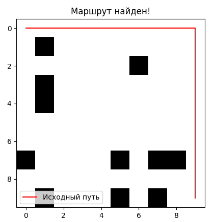
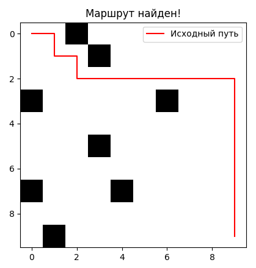
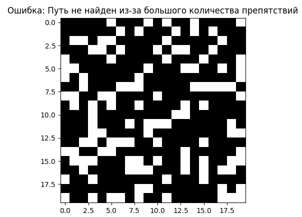
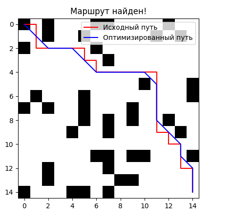

# Примеры и случаи использования

## 1. Сценарии использования системы навигации

### 1.1. Пример 1: Поиск пути на свободной карте

В этом сценарии система генерирует карту с минимальным количеством препятствий, и робот должен найти кратчайший путь от начальной точки до целевой. Карта практически свободна от препятствий, что позволяет системе быстро найти оптимальный маршрут.

#### Шаги:
1. Генерируется карта размером 10x10 с низкой вероятностью появления препятствий (10%).
2. Начальная точка находится в верхнем левом углу карты, а целевая точка — в правом нижнем углу.
3. Алгоритм A* выполняет поиск кратчайшего пути.
4. Путь визуализируется на карте.

```python
import numpy as np
import matplotlib.pyplot as plt
from navigation_system import generate_map, find_path, visualize_map_and_path
```
### Генерация карты размером 10x10 с 10% вероятностью появления препятствий
```python
mappy = generate_map(10, 10, 0.1)
```

### Задание начальной и конечной точек
```python
start = (0, 0)
target = (9, 9)
```
### Поиск пути с использованием алгоритма A*
```python
path = find_path(mappy, start, target)
```

### Визуализация карты и найденного пути
```python
visualize_map_and_path(mappy, path)
```

Объяснение:
Карта генерируется с небольшой вероятностью появления стен (wall_chance=0.1), что обеспечивает минимальные препятствия.

Алгоритм A* быстро находит кратчайший путь между двумя точками.
Визуализация позволяет пользователю увидеть, как робот будет перемещаться по карте.
### Пример 2: Карта с большим количеством препятствий
Этот сценарий демонстрирует, как система справляется с картой, где большое количество препятствий затрудняет поиск пути. Система может вернуть None, если путь не будет найден.

Шаги:
Генерируется карта размером 20x20 с высокой вероятностью появления препятствий (70%).
Алгоритм пытается найти путь между начальной и конечной точками.

Если путь не найден, выводится сообщение об ошибке.
```python
# Генерация карты размером 20x20 с 70% вероятностью появления препятствий
mappy = generate_map(20, 20, 0.7)

# Задание начальной и конечной точек
start = (0, 0)
target = (19, 19)

# Попытка найти путь
path = find_path(mappy, start, target)

# Проверка, был ли найден путь
if path is None:
    print("Ошибка: Путь не найден из-за большого количества препятствий.")
else:
    visualize_map_and_path(mappy, path)
```

Объяснение:
Высокая вероятность появления стен (wall_chance=0.7) делает карту сложной для навигации.
Если путь не может быть найден, система уведомляет пользователя об ошибке.
Если путь найден, он визуализируется на карте.
### Пример 3: Оптимизация пути
В этом сценарии система не только находит путь с использованием алгоритма A*, но и применяет оптимизацию для уменьшения количества поворотов, что делает движение робота более плавным.

Шаги:
Генерируется карта размером 15x15 со средней вероятностью появления препятствий (30%).
Сначала выполняется стандартный поиск пути.
Затем найденный путь оптимизируется для сокращения количества поворотов.
Визуализируются как исходный, так и оптимизированный пути.
```python
from navigation_system import optimize_path


# Генерация карты размером 15x15 с 30% вероятностью появления препятствий
mappy = generate_map(15, 15, 0.3)

# Поиск пути
path = find_path(mappy, start=(0, 0), target=(14, 14))

# Оптимизация пути
if path:
    optimized_path = optimize_path(path)

    # Визуализация исходного и оптимизированного пути
    plt.imshow(mappy, cmap='binary')
    path_array = np.array(path)
    opt_path_array = np.array(optimized_path)
    plt.plot(path_array[:, 1], path_array[:, 0], color='red', label="Исходный путь")
    plt.plot(opt_path_array[:, 1], opt_path_array[:, 0], color='blue', label="Оптимизированный путь")
    plt.legend()
    plt.show()
else:
    print("Путь не найден!")
```

Объяснение:
Сначала выполняется поиск пути, затем система применяет оптимизацию для сокращения поворотов.
Визуализируются два пути: исходный и оптимизированный, чтобы показать разницу.
Пример кода с комментариями.

Ниже представлен пример кода, демонстрирующий, как использовать основные функции системы: генерацию карты, поиск пути, оптимизацию маршрута и визуализацию.

```python
import numpy as np
import matplotlib.pyplot as plt
from navigation_system import generate_map, find_path, optimize_path, visualize_map_and_path

# Генерация карты размером 10x10 с 30% вероятностью появления препятствий
mappy = generate_map(10, 10, 0.3)

# Задание начальной и конечной точек
start = (0, 0)
target = (9, 9)

# Поиск пути с использованием алгоритма A*
path = find_path(mappy, start, target)

# Проверка, был ли найден путь
if path:
    # Оптимизация пути для уменьшения количества поворотов
    optimized_path = optimize_path(path)

    # Визуализация карты и обоих путей (исходного и оптимизированного)
    plt.imshow(mappy, cmap='binary')
    path_array = np.array(path)
    opt_path_array = np.array(optimized_path)
    plt.plot(path_array[:, 1], path_array[:, 0], color='red', label="Исходный путь")
    plt.plot(opt_path_array[:, 1], opt_path_array[:, 0], color='blue', label="Оптимизированный путь")
    plt.legend()
    plt.show()
else:
    print("Путь не найден!")
```
Объяснение:
```python
generate_map — генерирует карту с заданной вероятностью появления препятствий.

find_path — ищет кратчайший путь между двумя точками с помощью алгоритма A*.

optimize_path — оптимизирует найденный путь для минимизации поворотов.

visualize_map_and_path — визуализирует карту и найденный путь.
```

Этот код демонстрирует, как можно интегрировать основные функции системы в реальный сценарий и получить наглядный результат работы системы навигации.

