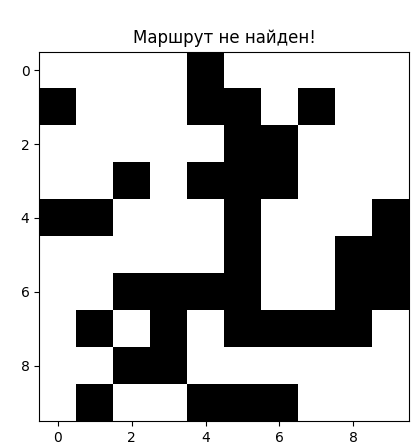
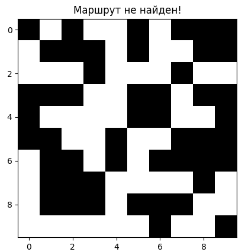

# Руководство по установке и настройке

## Системные требования

Для работы системы необходимы :


1. **Процессор (CPU)**:
    - Минимальные: 2-ядерный процессор с тактовой частотой не менее 2.0 ГГц.
    - Рекомендуемые: 4-ядерный процессор с тактовой частотой 3.0 ГГц или выше.

2. **Оперативная память (RAM)**:
   - Минимальные: 4 ГБ.
   - Рекомендуемые: 8 ГБ или выше.

3. **Свободное пространство на жестком диске**:
   - Минимальные: 500 МБ для установки системы и зависимостей.
   - Рекомендуемые: 1 ГБ для хранения данных, логов и карт.

4. **Графическая карта (для визуализации)**:
   - Минимальные: встроенная графическая карта, поддерживающая OpenGL 2.0.
   - Рекомендуемые: дискретная графическая карта с 1 ГБ видеопамяти.

5. **Дисплей**:
   - Разрешение не ниже 1280x720 пикселей для комфортной работы с интерфейсом и визуализацией карты.

# Программные требования

1. **Операционная система**:
   - Поддерживаемые операционные системы:
     - Windows 10/11 (x64)
     - Ubuntu 20.04+ (или другой дистрибутив на базе Linux)
     - macOS 11.0 (Big Sur) или выше

2. **Пакеты и библиотеки**:
   - Python версии 3.10 или выше.
   - **NumPy**: версии 1.26.4 (рекомендуемо) для работы с многомерными массивами и генерации карты.
     - Установка: `pip install numpy`
   - **Matplotlib**: версии 3.9.0 (рекомендуемо) для визуализации карты и траектории движения робота.
     - Установка: `pip install matplotlib`
   - **Heapq**: встроенная библиотека Python для реализации приоритетной очереди.
   - **Дополнительные пакеты (если требуется)**:
     - Scipy (для расширенной математической обработки, если она необходима в расширенной версии).

3. **Среды разработки (опционально)**:
   - Любая среда разработки, поддерживающая Python:
     - PyCharm (рекомендуется)
     - VS Code
     - Sublime Text
     - Jupyter Notebook (для быстрой проверки алгоритмов и визуализации).

# Сетевые требования

- **Интернет-соединение**: требуется для загрузки и установки зависимостей и обновлений системы.
- **Локальная сеть**: требуется, если система предполагает взаимодействие с другими системами или роботами через Wi-Fi или Ethernet.
## Установка зависимостей

1. Убедитесь, что на вашем компьютере установлен Python 3.10 или более поздняя версия. Для этого выполните команду:

   ```bash
   python --version
2.После установки Python и проверки версии переходим к установке библиотек , необходимых для работы системы навигации.
- **NumPy**: версии 1.26.4 (рекомендуемо) для работы с многомерными массивами и генерации карты.
     - Установка: `pip install numpy`
 - **Matplotlib**: версии 3.9.0 (рекомендуемо) для визуализации карты и траектории движения робота.
     - Установка: `pip install matplotlib`
  - **Heapq**: встроенная библиотека Python для реализации приоритетной очереди.
## Запуск системы
## Установка
*Для корректной установки требуется python3.12*
```shell
git clone https://github.com/tomasrock18/rob-in.git
cd rob-in
pip install -r requirements.txt
```

## Запуск
```shell
python3 main.py
```
Данная команда выполнит построение случайной карты и попробует применить алгоритм поиска пути. В случае отсутствия пути, программа отобразит карту, но без маршрута. Для повторного запуска, закройте окно qt и повторить вышеуказанную команду. (Или же просто можно открыть скрипт в любой удобной IDE)

## Описание функций
В данном решении реализованы 4 функции:
1) generate_map - функция создает карту с препятствиями.
2) heuristic - функция вычисляет эвристику между двумя точками.
3) find_path - реализует алгоритм A-Star на заданной карте.
4) optimize_path - оптимизирует переданный маршрут.

### Примеры использования
```python3
# Создаст произвольного размера карту, с вероятностью появления препятствия 30%
map = generate_map() 

# Аналогично, только число строк в матрице карты будет равно заданному, в данном случае 100
map = generate_map(100)

# Карта с заданными размерами, но вероятность препятствия всё так же 30%
map = generate_map(100, 100)

# Карта с заданными размерами, но уже с вдвое большей вероятностью появления препятствия
map = generate_map(100, 100, 0.6)
```

```python3
# Изначально это была лямбда функция, но PyCharm не понравилось, поэтому вынес её отдельно
delta = heuristic((0,0), (5,5))
```

```python3
# Передаём карту, получаем путь. Начало и конец заданы по-умолчанию.
path = find_path(map)

# Тоже самое, но теперь мы указали откуда начать движение
path = find_path(map, (10, 10))

# А теперь ещё и конец
path = find_path(map, (10, 10), (0, 0))
```

```python3
opt_path = optimize_path(path)
```
Для генерации карты используется функция `generate_map`, которая создает двумерную матрицу. Каждая клетка матрицы может быть свободной (значение 0) или содержать препятствие (значение 1).

### Пример генерации карты:

```python
import numpy as np

# Генерация случайной карты размером 10x10 с 30% вероятностью появления стен
height = 10
width = 10
wall_chance = 0.3
mappy = generate_map(height, width, wall_chance)
```


Вероятность появления стен можно настроить с помощью параметра wall_chance. Чем выше значение, тем больше препятствий будет на карте.
### Пример задания препятствий:
```python
# Установка вероятности появления препятствий на 50%
wall_chance = 0.5
mappy = generate_map(height, width, wall_chance)
```
