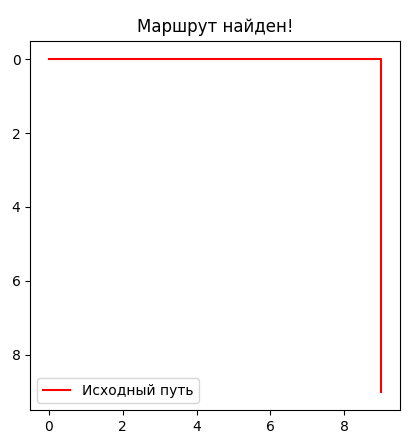
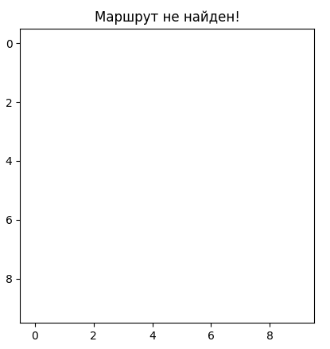
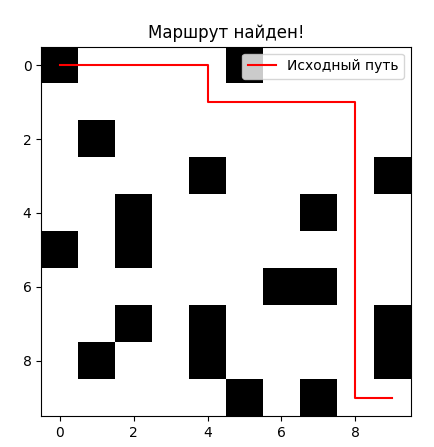

# Руководство пользователя

## Введение

Данное руководство объясняет, как использовать систему навигации для автономного робота. Эта система помогает находить кратчайший путь от начальной до конечной точки на карте с препятствиями. Система основана на алгоритме поиска пути A* и поддерживает визуализацию карты и найденного маршрута.

---

## 1. Использование системы навигации

### 1.1. Задание начальной и конечной точек

Перед тем как начать поиск пути, необходимо задать начальную и конечную точки на карте. Эти точки задаются как координаты на двумерной карте (матрице). По умолчанию:
- Начальная точка робота всегда находится в верхнем левом углу карты, с координатами (0, 0).
- Конечная точка робота — это правый нижний угол карты (height-1, width-1).

Однако, вы можете задать свои собственные координаты начальной и конечной точки, чтобы указать робот, откуда он должен начать движение и куда ему нужно двигаться.

#### Пример задания начальной и конечной точки:

```python
# Задание начальной и конечной точки
start = (0, 0)  # Начальная точка в левом верхнем углу карты
target = (9, 9)  # Конечная точка в правом нижнем углу на карте 10x10

# Поиск пути с использованием алгоритма A*
path = find_path(mappy, start, target)
```


start — это начальная точка робота, которую вы задаете в виде координат. Здесь (0, 0) — это начало пути (верхний левый угол).
target — это конечная точка, куда должен двигаться робот. Например, (9, 9) на карте 10x10 — это правая нижняя ячейка карты.
## Интерпретация результатов поиска пути
Результат работы системы зависит от того, удалось ли системе найти путь между указанными точками:

- Если путь найден, функция вернет список координат, которые нужно пройти роботу для достижения цели.
- Если путь не найден (например, из-за того, что путь полностью блокирован стенами), система вернет None.

#### Пример интерпретации результатов:
```python
# Проверка результата поиска пути
if path:
    print("Путь найден:", path)
else:
    print("Путь не найден!")
```


- Если путь существует, система выведет список координат, представляющий маршрут от начала до конца.
- Если путь не найден, система уведомит вас об этом, и вам нужно будет изменить параметры карты или точки начала/конца.

## Визуализация карты и пути
Для удобства работы с системой можно визуализировать как саму карту, так и путь, найденный роботом. Для этого используется библиотека matplotlib, которая позволяет отобразить карту и отметить маршрут, по которому движется робот.

#### Пример визуализации карты и пути робота:
```python
import matplotlib.pyplot as plt

# Отображение карты
plt.imshow(mappy, cmap='binary')

# Если путь найден, отобразим его на карте
if path:
    path_array = np.array(path)
    plt.plot(path_array[:, 1], path_array[:, 0], color='red', label="Путь")

# Показать карту с путем
plt.show()
```
- plt.imshow() — эта функция отображает карту, где каждая клетка матрицы визуализируется как черное или белое поле. Черные клетки — это препятствия, белые — свободные участки.
- plt.plot() — добавляет линию, которая отображает путь робота. Линия проходит через координаты, которые возвращает система.

##  Обработка ошибок
### Ошибка: Путь не найден
Одной из возможных ошибок является ситуация, когда робот не может найти путь от начальной до конечной точки. Это происходит, если:

- Конечная точка заблокирована препятствиями.
- Путь от начальной до конечной точки полностью заблокирован стенами.

В таких случаях система вернет None, что означает невозможность построить маршрут.
#### Пример обработки ошибки отсутствия пути:
```python 
# Попытка найти путь
path = find_path(mappy, start, target)

# Обработка ошибки, если путь не найден
if path is None:
    print("Ошибка: путь не найден. Проверьте карту на наличие непроходимых участков.")
else:
    print("Путь найден:", path)
```
- Если система вернула None, это значит, что путь не существует, и вам нужно будет проверить карту или изменить координаты начальной или конечной точки.

### Как решить проблемы с отсутствием пути
Если путь не найден, есть несколько способов решить эту проблему:

- Изменить параметры карты: можно уменьшить количество препятствий на карте, уменьшив значение переменной wall_chance. Это увеличит вероятность того, что путь будет найден.
- Изменить начальные или конечные координаты: иногда проблема заключается в том, что целевая точка расположена в непроходимом месте. Попробуйте изменить координаты целевой точки.
#### Пример генерации новой карты с меньшим количеством препятствий:
```python
# Генерация карты с 20% вероятностью появления стен (меньше препятствий)
mappy = generate_map(height=10, width=10, wall_chance=0.2)
```


- Уменьшение вероятности появления препятствий повышает шансы найти путь, поскольку на карте будет меньше блокирующих ячеек.
### Заключение
Теперь вы знаете, как:

- Задать начальные и конечные точки для поиска пути.
- Проверить, нашла ли система путь, и как интерпретировать результаты.
- Визуализировать карту и путь робота для наглядного отображения.
- Обрабатывать ошибки, связанные с отсутствием пути, и как решить проблемы с непроходимыми участками карты.

Используйте это руководство для успешного использования системы навигации автономного робота.